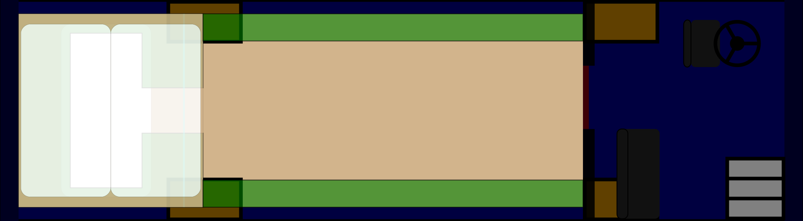

# serenity
plans, designs, and considerations for travelling housing

## Sections

Specific systems are discussed in their own section:

* [The Substrate](substrate/)
* [Sunshine, Oil, Wood, and Wire](energy/)
* [Look at my life; Look at my choices](living/)
* [Everything and the Kitchen Sink](kitchen/)
* [Melons, Morning Glories, and Mushrooms](growth/)
* [Interfacing with the State](legal/)
* [Mark and Sweep vs Escape Analysis](garbage/)

