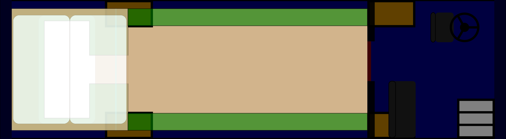

# Look at my life; Look at my choices

## Rough layout

We approach the house from the south side, it's nose facing east.
A front and back entrance, garden layed out between them.
We climb up the steps in the front to see th driver's seat,
with one bench by the stairs for passengers when moving
(and a place to set things down when parked).
That bench and the space across from it form the mud room,
a wall separating the rest of the house with hooks for coats and things,
the space under the bench (and coats) for boots and such.
